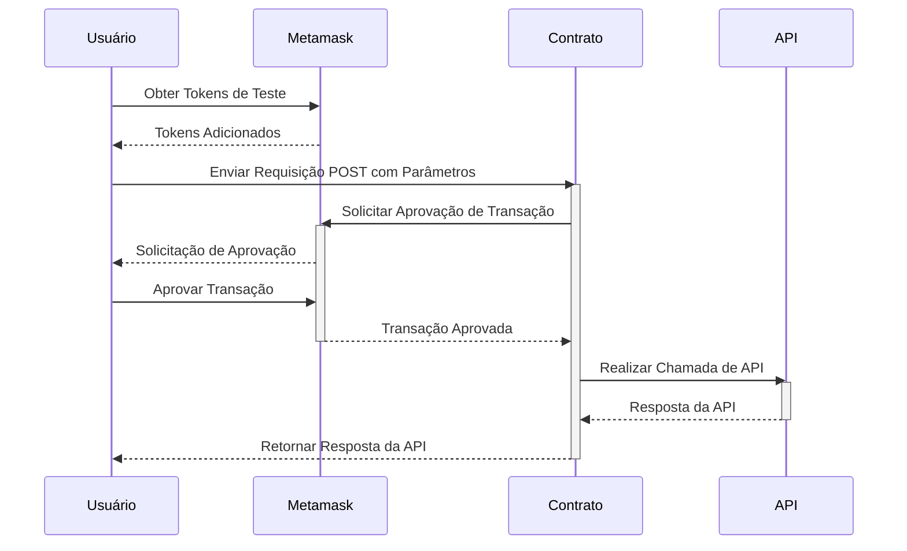

# api_pay_per_call with Blockchain and Metamask

## Sobre o Projeto

O projeto 'api_pay_per_call with Blockchain and Metamask' é uma solução inovadora que integra o uso de Blockchain e a carteira Metamask para gerenciar e cobrar por chamadas de API. Este sistema permite aos desenvolvedores e empresas monitorar e controlar o uso de APIs, garantindo um modelo de cobrança transparente e eficiente baseado em tokens.

## Como funciona

1 - Adiquira tokens de test para a sua carteira Metamask

https://govinda777.github.io/blog//Artigo-Blockchain-Tutorial-como-conseguir-tokens-de-test/

2 - Chame o Smart Contract com os parametros da sua chamada

Request : 

POST - https://api_pay_per_call.govindasystems.com/

body
{
    timeout: 10000,
    api-param: {}
}

Response :

{
    <API_RESPONSE>
}

3 - Aprove a transação na Metamask

#Veja que a cada chamada de API é debitado um token da sua carteira Metamask

## Funcionalidades

- **Controle de Acesso**: Gerencia quem pode acessar a API com base na posse de tokens.
- **Cobrança por Chamada**: Implementa um sistema de pagamento por uso, onde tokens são debitados por cada chamada de API.
- **Integração com Metamask**: Usa a carteira Metamask para facilitar as transações de tokens.
- **Registro na Blockchain**: Mantém um registro imutável e seguro das transações e uso da API na Blockchain.
- **Integração Off Chain com On Chain**: Utilizando a Chainlink e os Oracles, é possível integrar dados off chain com on chain, garantindo a transparência e segurança dos dados.

## Fluxo de debito de tokens

1. **Autenticação**: O usuário se autentica usando a carteira Metamask.
2. **Verificação de Token**: O sistema verifica se o usuário possui tokens suficientes.
3. **Chamada da API**: Após a verificação, a chamada de API é permitida.
4. **Débito de Token**: Tokens são debitados da carteira do usuário por cada chamada realizada.

## Pré-Requisitos

- Carteira Metamask instalada e configurada.
- Tokens compatíveis com a aplicação.
- Conhecimento básico de Blockchain e APIs.

## Casos de uso

Eu como Departamento A
Quero poder controlar o uso de uma API
Para que possamos cobrar por chamadas de API
Então poderei limitar o uso de API para usuários que possuem tokens suficientes

## Configuração e Instalação

1. Clone o repositório: `git clone [URL do Repositório]`.
2. Instale as dependências: `yarn install`.
3. Configure as variáveis de ambiente conforme a documentação.
4. Inicie o servidor: `yarn start`.

## Contribuição

Contribuições são sempre bem-vindas! Se você tem alguma ideia para melhorar o aplicativo ou encontrar algum bug, sinta-se à vontade para criar uma issue ou enviar um pull request.
